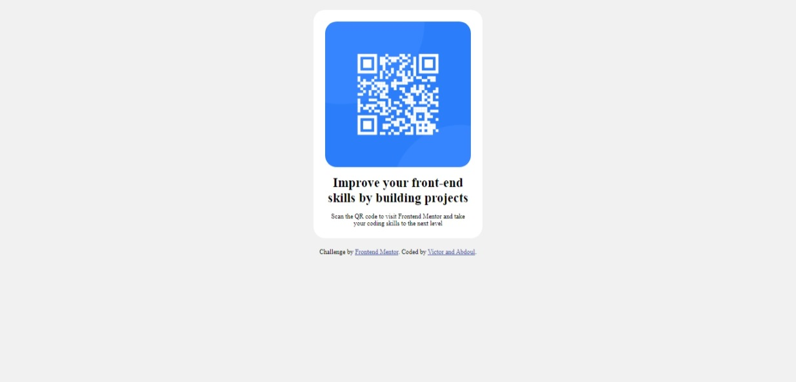

## Table of contents

- [Overview](#overview)
  - [Screenshot](#screenshot)
  - [Links](#links)
  - [Built with](#built-with)
  - [Continued development](#continued-development)
  - [Useful resources](#useful-resources)
- [Author](#author)

## Overview

The QR component is a simple and easy-to-use component that allows you to generate QR codes and display them on your website or application. This component is built using HTML and CSS and can be easily customized to match the style of your website or application.

### Screenshot

This is the screenshot of the project

### Links

- Solution URL: (https://github.com/aradradev/QR-CODE)
- Live Site URL: (https://qr-code-sigma-two.vercel.app/)

### Built with
- HTML5
- CSS3 properties
- Flexbox

### Continued development

We would like to improve on how to use
-Flexbox
-CSS grid

### Useful resources

- (https://developer.mozilla.org/fr/docs/Learn/CSS/CSS_layout/Flexbox) - This helped me to use the flexbox property. I really liked this pattern and will use it going forward.

## Author

- Website - [Victor, Abdoul](https://github.com/Victoryara)(https://github.com/aradradev)
